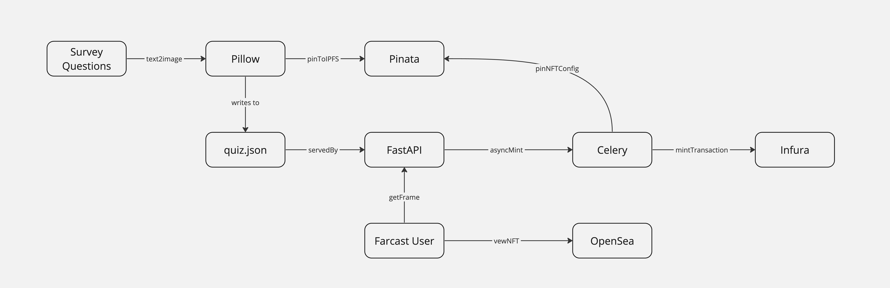

This is a backend for a farcaster survey. It gives users a Soul-Bound-Token on Polygon-PoS summarizing their responses, with different images depending on which quadrant they fall into. There are two axes: Creative/Structured and Individualist/Collectivist. The survey is displayed to Farcaster users as a series of Farcaster frames, served from FastAPI over Uvicorn. A SQLAlchemy database stores the various surveys and responses. A separate process is run for minting the SBTs, which is done on behalf of the user. Communication between processes takes place over celery and rabbitMQ. The scripts run-celery.sh and run-server.sh run the two processes.

You will need to supply Pinata, Neynar and Infura keys via env vars to run it. See .env.sample

System diagram: 

